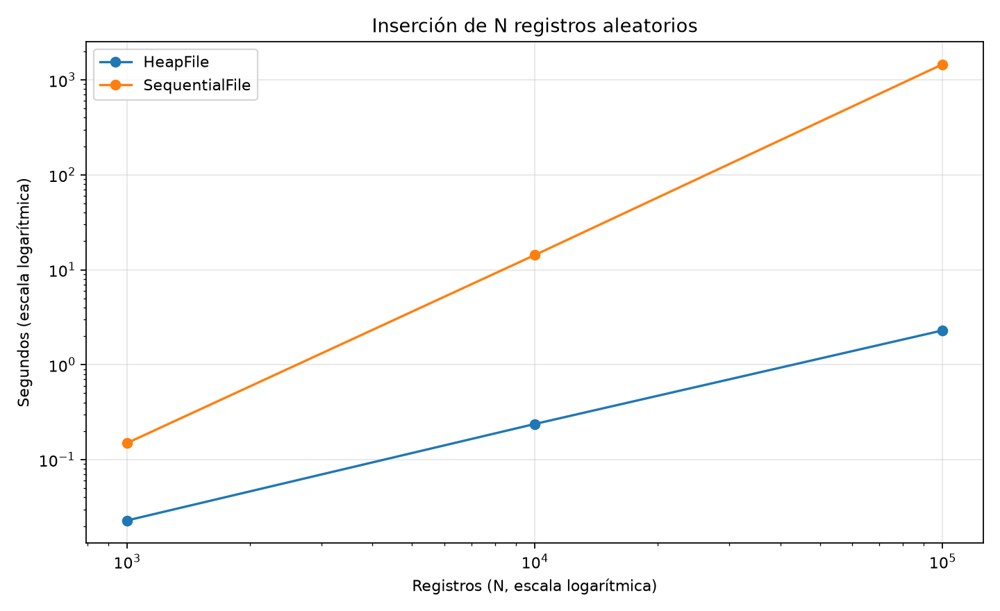
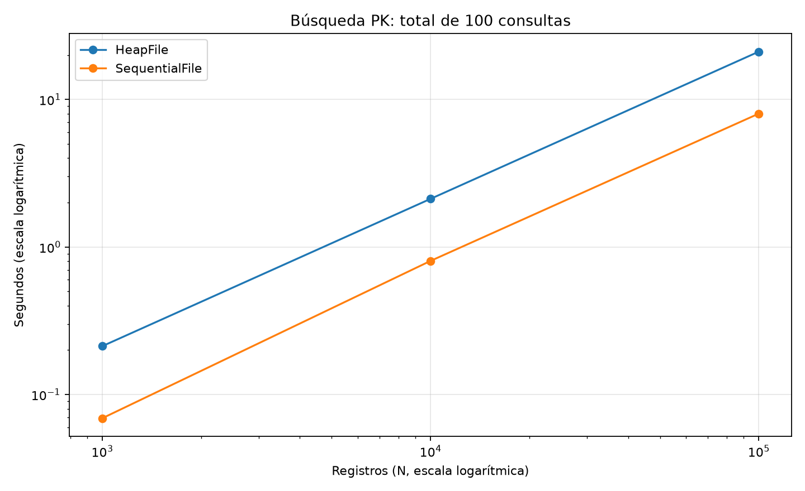
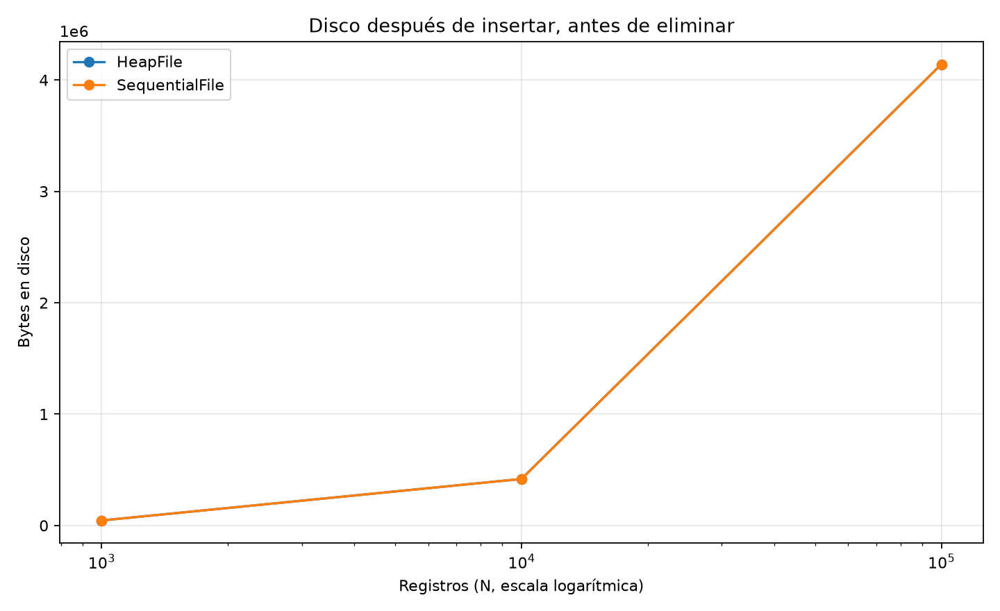
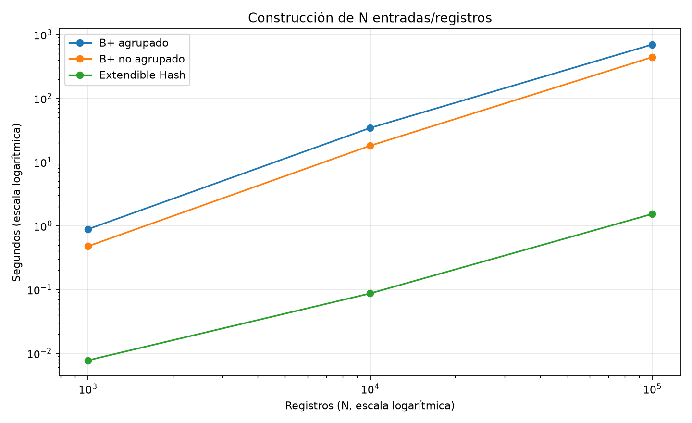
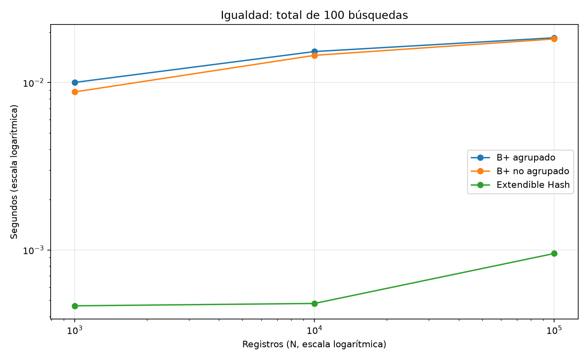
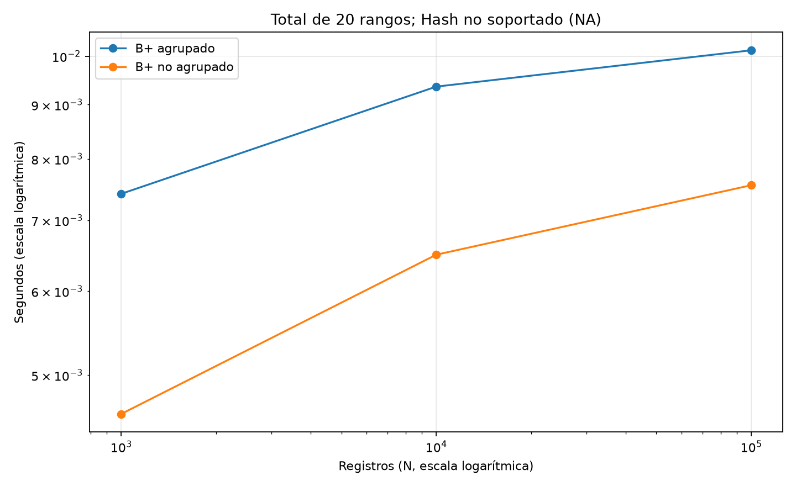
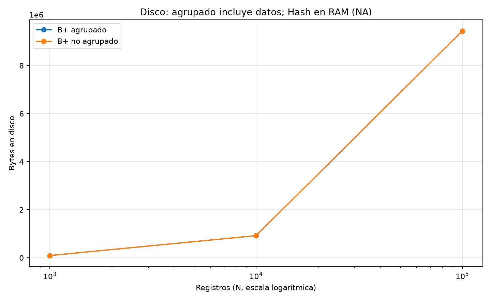
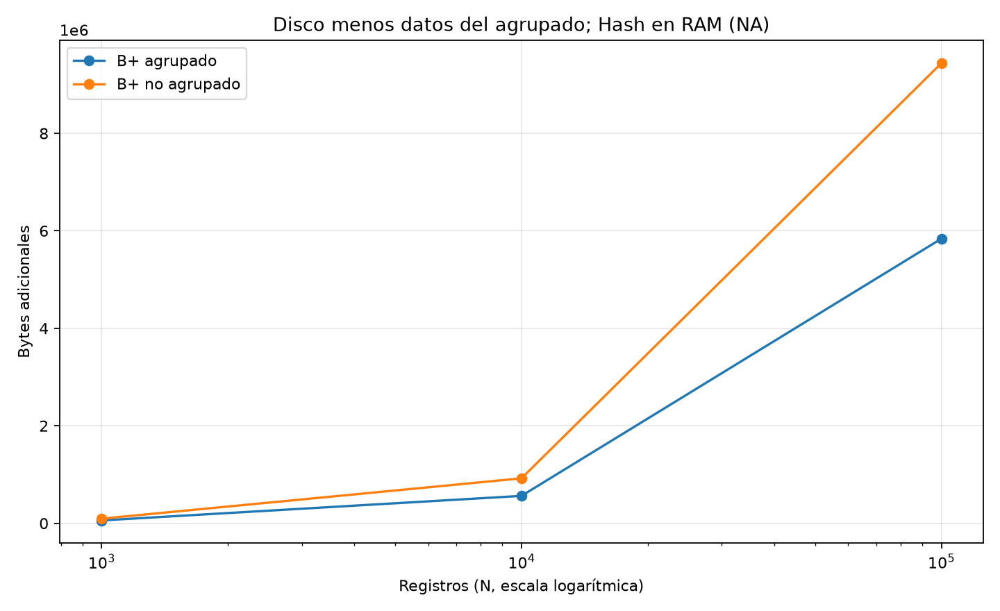
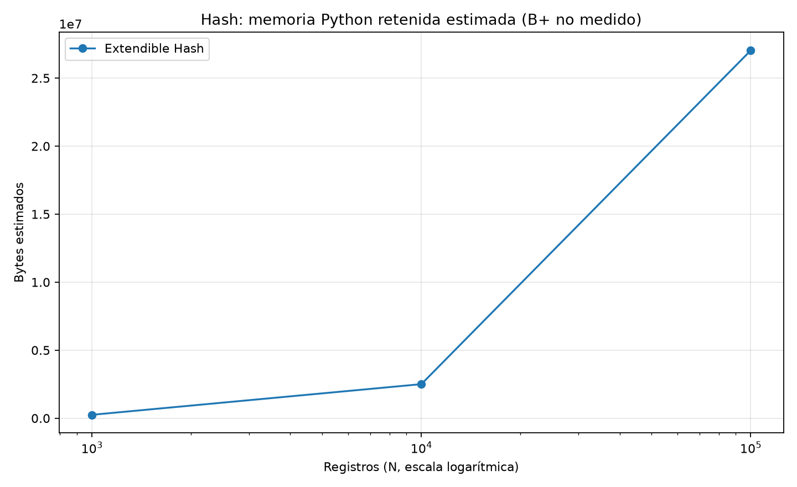
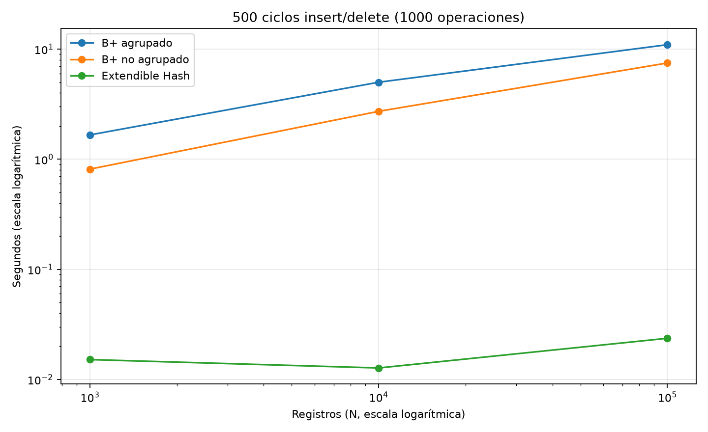

# Informe del Proyecto — Base de Datos II

## Avance 1: Motor Relacional

### 1. Arquitectura del Motor
- **Almacenamiento**: Heap File (Slotted Page) y Archivo Secuencial Paginado.
- **Índices**: B+ Tree Clustered, B+ Tree Unclustered, Extendible Hashing.
- **Consultas**: Lexer, Parser SQL, Planner, Executor y Algoritmos Externos.
- **Concurrencia**: Lock Manager (Shared/Exclusive) y control de transacciones.
- **Frontend**: Interfaz gráfica de 4 paneles (archivos, consultas, resultados, plan).

### 2. Decisiones de Diseño y Algoritmos

#### 2.1 Heap File con Arquitectura Slotted Page
Se implementó el almacenamiento en disco mediante páginas de tamaño fijo (**4096 bytes / 4 KB**), alineadas con el tamaño de bloque del sistema operativo y hardware de almacenamiento.

* **Estructura de Página**:
  - **Header (4 bytes)**: `num_slots` (uint16) y `data_end` (uint16).
  - **Área de Datos**: Crece desde el inicio (byte 4) hacia adelante.
  - **Directorio de Slots**: Crece desde el final (byte 4096) hacia atrás. Cada slot ocupa **5 bytes** (`offset: 2B`, `length: 2B`, `is_deleted: 1B`).
  - **Espacio Libre**: Bloque continuo en el centro (`slot_dir_start - data_end`), evitando fragmentación y eliminando la necesidad de desplazar datos en memoria.

* **Estabilidad de Punteros (RID)**:
  - Cada registro es identificado de forma única por un `RID(page_id, slot_id)`.
  - Se utiliza **eliminación lógica** (`is_deleted = 1` en el slot), preservando la posición física del slot para que los índices externos (B+ Tree y Hash) no queden corruptos.

* **Reutilización de Espacio**:
  - En inserciones, el motor primero busca slots marcados como eliminados para sobreescribir su espacio antes de consumir nuevo espacio contiguo.
  - El motor mantiene en memoria un conjunto `free_pages` que se actualiza dinámicamente con las páginas candidatas para inserción sin requerir escaneos completos de disco.

#### 2.2 Archivo Secuencial Paginado (Sequential File)
Diseñado para tablas con orden físico por clave primaria o de ordenamiento, combinando páginas ordenadas con un área de desborde y reorganización periódica.

* **Estructura Física Dual (`main` y `aux`)**:
  - **`main`**: Páginas donde los registros y el directorio de slots se mantienen estrictamente ordenados por clave.
  - **`aux`**: Archivo de desborde (*overflow*) sin orden para inserciones rápidas cuando la página destino de `main` no cuenta con espacio suficiente.
  - **Identificador `RID(page_id, slot_id, file)`**: Registra el archivo de origen (`"main"` o `"aux"`), permitiendo accesos y eliminaciones transparentes.

* **Búsqueda e Inserción Binaria en Dos Niveles**:
  - **Nivel de Archivo**: Búsqueda binaria sobre una tabla en memoria de rangos de claves `_page_bounds` `[(min_key, max_key)]` por página.
  - **Nivel de Página**: Búsqueda binaria directa sobre el directorio de slots (`_binary_search_in_page` para búsquedas e `_find_insert_position_in_page` para inserción).
  - **Inserción ordenada eficiente**: `insert_sorted_at` desplaza únicamente las entradas del directorio de slots (5 bytes por slot) hacia la izquierda en memoria, sin reubicar los datos de los registros. Si la página está llena, el registro se almacena en `aux`.

* **Eliminación Lógica**:
  - Marca `is_deleted = 1` en el slot sin compactación inmediata física y actualiza `_page_bounds` para mantener la coherencia de los límites del archivo.

* **Inestabilidad de RIDs en `main` (Trade-off de Diseño)**:
  - A diferencia del Heap File, los RIDs devueltos por operaciones de inserción en `main` no son estables frente a inserciones posteriores en la misma página, dado que el reordenamiento del directorio de slots desplaza el `slot_id` de los registros existentes. Por diseño, el acceso recomendado a este storage es mediante `search_by_key`, no mediante almacenamiento externo persistente de RIDs.

* **Disparador de Reorganización (>30%)**:
  - `needs_reorganization()` monitorea el porcentaje de registros obsoletos o desbordados: `(deleted_main + aux_count) / total > 0.30`. Al superarse este umbral, se requiere compactación.

* **Reorganización con `fill_factor` (Decisión Propia de Diseño)**:
  - Se extraen todos los registros activos de `main` y `aux`, se ordenan por clave y se purgan definitivamente los registros eliminados.
  - Se reconstruye `main` aplicando un `fill_factor` (**0.9 / 90%** de capacidad por página). Esta holgura del 10% es una optimización de diseño para admitir futuras inserciones ordenadas directamente en `main` sin provocar desbordes inmediatos hacia `aux`, evitando reorganizaciones consecutivas prematuras.

#### 2.3 Índice Hash Dinámico (Extendible Hashing)

Implementado en `engine/indexes/extendible_hash.py` para acelerar búsquedas por igualdad sobre registros almacenados en Heap File o Sequential File. El índice mantiene un directorio global y buckets con capacidad configurable, adaptando su estructura mediante divisiones y fusiones.

* **Directorio Global y Buckets**:
  - El directorio contiene `2 ** global_depth` referencias a buckets. Inicialmente, la profundidad global es **1** y existen **dos buckets** con profundidad local **1**.
  - Cada bucket almacena pares **`(clave, RID)`**, conservando el registro completo en el archivo de datos. El RID incluye `page_id`, `slot_id` y `file`, permitiendo distinguir `main` y `aux`.
  - `bucket_capacity` limita la cantidad de pares por bucket (**4 por defecto**). Varias entradas del directorio pueden apuntar al mismo bucket cuando su profundidad local es menor que la global.

* **Función Hash y Profundidades**:
  - Se utiliza **BLAKE2b de 64 bits** sobre una representación estable de la clave, evitando la variación de `hash(str)` entre procesos de Python.
  - Los bits menos significativos seleccionan la posición del directorio mediante `hash_clave & ((1 << global_depth) - 1)`. La profundidad global determina cuántos bits se consultan y la local cuántos identifican a cada bucket.
  - Se admiten claves `int`, `float` finitos y `str`. Valores numéricamente iguales, como `1` y `1.0`, se consideran la misma clave.

* **Inserción, Split y Duplicación del Directorio**:
  - `insert(key, rid)` localiza el bucket y agrega el par si existe espacio. Las claves repetidas con distintos RIDs están permitidas; un par idéntico no se inserta dos veces.
  - Si el bucket está lleno y sus entradas pueden separarse, se incrementa su profundidad local, se crea un bucket hermano y se redistribuyen los pares según el nuevo bit disponible.
  - Cuando la profundidad local iguala la global antes del split, se duplica el directorio y se incrementa la profundidad global, conservando las referencias a los buckets que no se dividen.

* **Colisiones y Buckets de Desborde (Decisión de Diseño)**:
  - Las claves repetidas y los hashes que no se pueden separar con los bits disponibles utilizan una cadena de buckets de desborde, cada uno sujeto a `bucket_capacity`.
  - `max_depth` limita el crecimiento del directorio (**16 por defecto**, configurable entre **1 y 20**). Al alcanzar ese límite también se utiliza desborde, evitando divisiones indefinidas.

* **Búsqueda por Igualdad**:
  - `search(key)` accede al bucket indicado por el hash y recorre sus entradas y su cadena de desborde, comparando las claves para distinguir colisiones.
  - Devuelve todos los RIDs coincidentes, o una lista vacía si la clave no existe. Los registros completos se recuperan mediante `storage.get(rid)`; el índice no implementa búsquedas por rango.

* **Eliminación, Merge y Contracción**:
  - `delete(key, rid)` elimina un par específico; sin RID, elimina todas las entradas de la clave. La operación devuelve la cantidad de pares eliminados y compacta la cadena de desborde.
  - Se fusionan buckets hermanos cuando tienen la misma profundidad local y sus entradas combinadas caben en un solo bucket. Las referencias del directorio se actualizan al bucket resultante.
  - Si ambas mitades del directorio contienen las mismas referencias, este se reduce a la mitad. La contracción se repite hasta donde sea posible, manteniendo una profundidad global mínima de **1**.

* **Carga Masiva e Integración con Storage**:
  - `bulk_load` recibe un iterable de pares `(clave, RID)`. `bulk_load_from_storage` obtiene esos pares recorriendo los registros activos del archivo mediante `scan()` y extrayendo el campo indexado.
  - Se agregó `SequentialFile.scan()` para recorrer `main` y `aux` con sus RIDs físicos actuales, omitiendo registros eliminados. La fuente se procesa de forma incremental, mientras el índice resultante reside en memoria.
  - La carga desde storage reconstruye el índice por defecto: solo reemplaza la estructura anterior cuando termina correctamente. Si falla, conserva el índice anterior; durante la construcción ambas estructuras ocupan memoria.
  - Las inserciones ordenadas y reorganizaciones del Sequential File pueden invalidar RIDs existentes, por lo que requieren reconstruir el índice antes de consultarlo. La sincronización entre storage e índice es responsabilidad de la aplicación.

* **Persistencia Opcional y Alcance**:
  - El directorio y los buckets operan en memoria. Al especificar `filepath`, se guarda un **snapshot JSON versionado** con la configuración y los pares mediante `flush()`, `close()` o al salir de un bloque `with`.
  - El guardado escribe un archivo temporal y reemplaza el destino al terminar. Al reabrir, se reconstruye el directorio a partir de las entradas persistidas.
  - Esta implementación no utiliza páginas de buckets en disco ni proporciona transacciones entre el índice y el storage. `stats()` reporta profundidad, entradas, buckets únicos, desborde y ocupación sin contar dos veces las referencias compartidas.

* **Validación mediante Pruebas**:
  - Las pruebas cubren splits con y sin duplicación del directorio, claves repetidas, colisiones forzadas, eliminación y fusión de buckets, y operaciones aleatorias contrastadas con un modelo de referencia.
  - También verifican carga masiva desde ambos storages, reconstrucción tras cambios de RIDs y persistencia entre procesos, incluyendo la conservación del snapshot anterior ante un fallo de guardado.

### 3. Resultados Experimentales y Benchmarks

#### 3.1 Protocolo Experimental — Issue #10

Se implementaron scripts independientes del frontend en `benchmarks/`. El módulo
`generate_datasets.py` genera IDs únicos en orden aleatorio, nombres ASCII de
20 caracteres y precios, con semilla **42**. El schema ocupa **36 bytes por
registro**, antes del header de página y directorio de slots.

* **Carga y consultas**: 1.000, 10.000 y 100.000 registros, con las mismas claves
  y orden de inserción para todas las técnicas. Se miden tiempos totales con
  `time.perf_counter()`: inserción/construcción, 100 búsquedas existentes y, para
  B+, 20 rangos de hasta 101 claves. Las verificaciones se realizan fuera del
  intervalo medido.
* **Reorganización**: el espacio y las búsquedas se miden después de insertar,
  antes de borrar/reorganizar. En SequentialFile se elimina el 35% de claves con
  RIDs actuales, se confirma el umbral y se cronometra solamente `reorganize()`.
  El overflow puede activar el umbral incluso antes de los borrados. No se
  modificó el algoritmo de inserción ni se reorganizó para favorecer búsquedas.
* **Índices**: páginas B+ de 4096 bytes y máximo 64 claves; hash con 64 entradas
  por bucket y profundidad máxima 16. El agrupado guarda registros completos;
  el no agrupado y el hash guardan pares clave/RID sintético. Estos últimos no
  incluyen el costo de recuperar el registro desde un heap. Se miden además
  500 ciclos intercalados de inserción y eliminación de claves nuevas.
* **Espacio**: se separa disco de RAM. El archivo agrupado incluye los datos;
  para estimar su espacio adicional se restan N × 36 bytes. El no agrupado no
  contiene los registros. La memoria del hash se aproxima con `sys.getsizeof`
  sobre su grafo de objetos, contando referencias compartidas una sola vez;
  no representa RSS ni memoria pico.
* **Entorno y alcance**: una corrida por tamaño, sin vaciar la caché del SO.
  Los B+ escriben páginas con flush; el hash opera en memoria sin snapshots.
  No se fuerza fsync. Los temporales de esta ejecución están en **`/tmp`, un
  filesystem `tmpfs` respaldado por memoria**: las cifras no son latencias de
  un SSD ni prueban superioridad universal de una estructura. La máquina usa
  **Intel Core i5-12450H**; las versiones y tiempos completos quedan registrados
  en los archivos `*_metadata.json`.

Los resultados reducidos (100, 1.000 y 5.000 registros) se conservaron en
[`benchmarks/results/smoke/`](../benchmarks/results/smoke/). Ambos scripts
terminaron sin errores, verificaron sus resultados y generaron los CSV y PNG.
Las instrucciones de reproducción están en
[`benchmarks/README.md`](../benchmarks/README.md).

#### 3.2 Ventajas y Limitaciones de las Técnicas

| Técnica | Ventajas | Limitaciones / uso recomendado |
| --- | --- | --- |
| HeapFile | Inserción sin mantener orden; RIDs estables con eliminación lógica. | La búsqueda PK sin índice recorre registros; combinar con índice para consultas frecuentes. |
| SequentialFile | Búsqueda binaria en main; reorganización ordena y compacta datos. | El overflow se recorre linealmente; inserciones aleatorias y mantenimiento tienen costo. Sus RIDs pueden cambiar. |
| B+ agrupado | Igualdad y rangos; registros completos en hojas ordenadas. | Splits/merges mueven datos; mayor trabajo por entrada y sin RIDs estables de hojas. |
| B+ no agrupado | Igualdad, rangos y recorrido ordenado con claves/RIDs compactos. | Recuperar datos requiere acceso adicional al storage; mantener sincronizados los RIDs. |
| Extendible Hash | Acceso directo por hash para igualdad; expansión y fusión de buckets. | Sin rangos ni orden; en esta implementación reside en RAM y su persistencia es por snapshot. |

#### 3.3 Heap File vs Archivo Secuencial

Medición del **18 de septiembre de 2026**, Python **3.14.7**, matplotlib **3.11.2**.
La corrida completa duró **1.513,481 s (25 min 13 s)**, incluyendo generación,
verificación y gráficas. Tiempos por operación experimental en segundos:

| Técnica | N | Inserción de N | 100 búsquedas PK | Disco (bytes) | Reorganización |
| --- | ---: | ---: | ---: | ---: | ---: |
| HeapFile | 1.000 | 0,022871 | 0,212630 | 45.056 | NA |
| SequentialFile | 1.000 | 0,149530 | 0,069035 | 45.056 | 0,003647 |
| HeapFile | 10.000 | 0,237460 | 2,118676 | 417.792 | NA |
| SequentialFile | 10.000 | 14,286807 | 0,804472 | 417.792 | 0,036352 |
| HeapFile | 100.000 | 2,296409 | 21,079896 | 4.141.056 | NA |
| SequentialFile | 100.000 | 1.459,402136 | 8,013247 | 4.141.056 | 0,374408 |

Datos completos: [CSV de storage](../benchmarks/results/storage_comparison.csv),
[salida de consola](../benchmarks/results/storage_console.txt) y
[metadatos](../benchmarks/results/storage_metadata.json).

* **Inserción**: en N=100.000, el tiempo del secuencial fue **635,51 veces** el
  de HeapFile. La inserción en aux recorre las páginas existentes; con entradas
  aleatorias este trabajo crece considerablemente. Se conserva la implementación
  original del motor, sin optimizaciones introducidas para este experimento.
* **Búsqueda**: HeapFile consumió **2,63 veces** el tiempo del secuencial para
  las 100 consultas de N=100.000. Son búsquedas antes de reorganizar, incluyendo
  el recorrido del overflow; no se interpreta esta cifra como búsqueda binaria
  sobre todos los registros. Al pasar de 10.000 a 100.000 registros, ambos
  tiempos de búsqueda aumentaron aproximadamente diez veces, consistente con
  el peso de los recorridos lineales en esta carga.
* **Espacio**: ambos ocuparon la misma cantidad de bytes en los tres tamaños.
  El secuencial divide sus páginas entre main y aux, pero eso no produjo ahorro
  de espacio antes de los borrados en esta carga.
* **Mantenimiento**: reorganizar los 65.000 registros restantes tomó
  **0,374408 s**. Esta cifra excluye localizar/eliminar las 35.000 claves y
  verificar el resultado; debe considerarse un costo adicional a la carga.
  Tampoco incluye reconstruir índices externos cuyos RIDs hayan cambiado.

#### 3.4 B+ Agrupado vs B+ No Agrupado vs Hash Dinámico

La corrida completa de índices duró **1.231,015 s (20 min 31 s)**. Sumada a la
de storage, la ejecución de los tamaños oficiales tomó **2.744,495 s (45 min
44 s)**. Se ejecutaron consecutivamente para evitar competencia entre ambos
benchmarks. Los siguientes tiempos son totales en segundos:

| Técnica | N | Construcción | 100 igualdades | 20 rangos | 500 ciclos insert/delete |
| --- | ---: | ---: | ---: | ---: | ---: |
| B+ agrupado | 1.000 | 0,880939 | 0,010016 | 0,007414 | 1,662218 |
| B+ no agrupado | 1.000 | 0,475835 | 0,008788 | 0,004595 | 0,812609 |
| Extendible Hash | 1.000 | 0,007724 | 0,000463 | NA | 0,015140 |
| B+ agrupado | 10.000 | 34,242905 | 0,015316 | 0,009359 | 5,001173 |
| B+ no agrupado | 10.000 | 17,996046 | 0,014537 | 0,006495 | 2,722059 |
| Extendible Hash | 10.000 | 0,086604 | 0,000479 | NA | 0,012707 |
| B+ agrupado | 100.000 | 698,397620 | 0,018516 | 0,010128 | 10,963724 |
| B+ no agrupado | 100.000 | 442,521788 | 0,018218 | 0,007554 | 7,480661 |
| Extendible Hash | 100.000 | 1,530415 | 0,000952 | NA | 0,023630 |

El rango del hash aparece como **NA: operación no soportada**. No se emula con
un scan ni se grafica como tiempo cero. Un ciclo de actualización contiene una
inserción y una eliminación: la última columna mide **1.000 operaciones**.

| Técnica | N | Archivo completo (bytes) | Disco adicional (bytes) | RAM estimada (bytes) |
| --- | ---: | ---: | ---: | ---: |
| B+ agrupado | 1.000 | 94.208 | 58.208 | No medida |
| B+ no agrupado | 1.000 | 94.208 | 94.208 | No medida |
| Extendible Hash | 1.000 | No persistido | No persistido | 251.051 |
| B+ agrupado | 10.000 | 921.600 | 561.600 | No medida |
| B+ no agrupado | 10.000 | 921.600 | 921.600 | No medida |
| Extendible Hash | 10.000 | No persistido | No persistido | 2.504.675 |
| B+ agrupado | 100.000 | 9.437.184 | 5.837.184 | No medida |
| B+ no agrupado | 100.000 | 9.437.184 | 9.437.184 | No medida |
| Extendible Hash | 100.000 | No persistido | No persistido | 27.037.259 |

Ambos B+ asignaron **2.303 páginas de nodos más una de cabecera** en N=100.000.
Con el mismo M y orden de claves, su tamaño de archivo coincidió; el agrupado
almacena además los 3.600.000 bytes de registros. Esto no significa que un B+
no agrupado tenga siempre el mismo tamaño que uno agrupado: aquí se fijaron
las mismas 64 claves máximas por nodo, con diferentes cantidades de holgura.
El hash terminó con **2.081 buckets y 4.096 entradas de directorio**, sin overflow.
Su estimación de RAM incluye los objetos Python de claves/RIDs; no debe
compararse directamente con los bytes de un archivo como si fueran el mismo
recurso. La RAM del B+ y el snapshot del hash no se midieron.

Datos completos: [CSV de índices](../benchmarks/results/indexes_comparison.csv),
[salida de consola](../benchmarks/results/indexes_console.txt) y
[metadatos](../benchmarks/results/indexes_metadata.json).

#### 3.5 Conclusiones de la Comparación de Índices

* **Construcción**: en N=100.000, el agrupado tomó **1,58 veces** el tiempo del
  no agrupado. El agrupado procesa registros completos en sus hojas; el no
  agrupado procesa RIDs. El hash tardó **1,530415 s**, pero esta construcción
  se realiza en RAM y excluye su snapshot, mientras los B+ escriben páginas.
* **Igualdad**: las 100 consultas tomaron **0,018516 s**, **0,018218 s** y
  **0,000952 s** para agrupado, no agrupado y hash. El hash fue el de menor
  tiempo en esta carga. El acceso posterior al registro desde un RID no está
  incluido, por lo que no son tres mediciones equivalentes de recuperación
  completa de registros.
* **Rangos y orden**: los dos B+ resolvieron los 20 rangos; el agrupado tardó
  **0,010128 s** y el no agrupado **0,007554 s**, devolviendo registros y RIDs,
  respectivamente. El hash no ofrece esta operación y no sustituye al B+
  para consultas de rango u ordenamiento.
* **Actualizaciones y alcance**: los 500 ciclos tomaron **10,963724 s**,
  **7,480661 s** y **0,023630 s**. Estos resultados describen las implementaciones
  y parámetros probados con claves únicas; no se extrapolan a otras capacidades,
  distribuciones, cargas concurrentes o dispositivos físicos. Repetir varias
  corridas sería necesario para cuantificar la variación de los tiempos.
