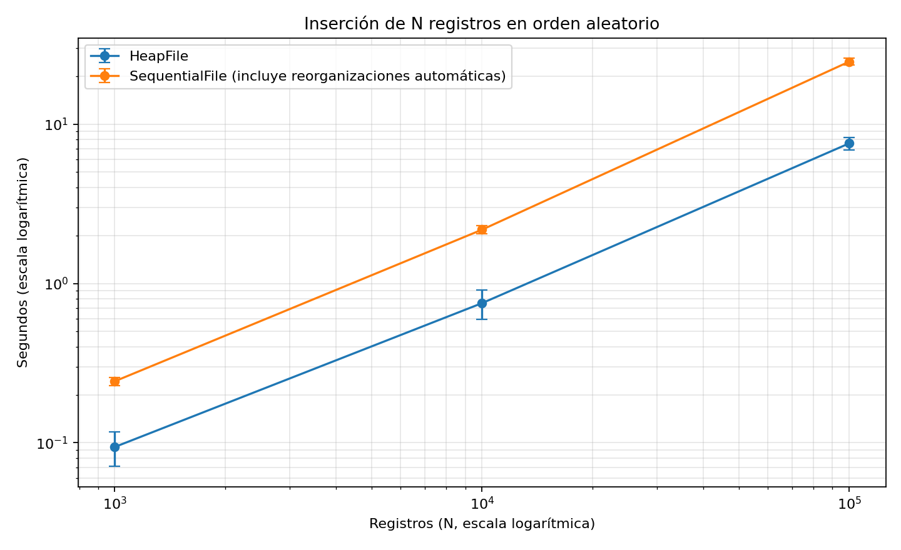
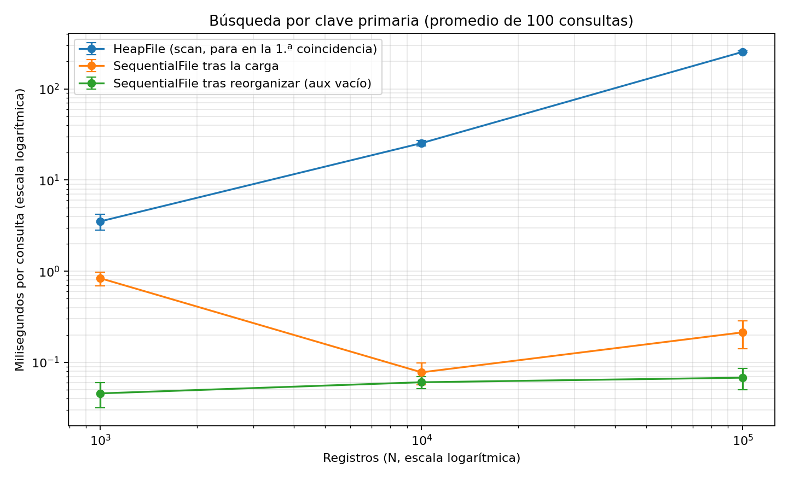
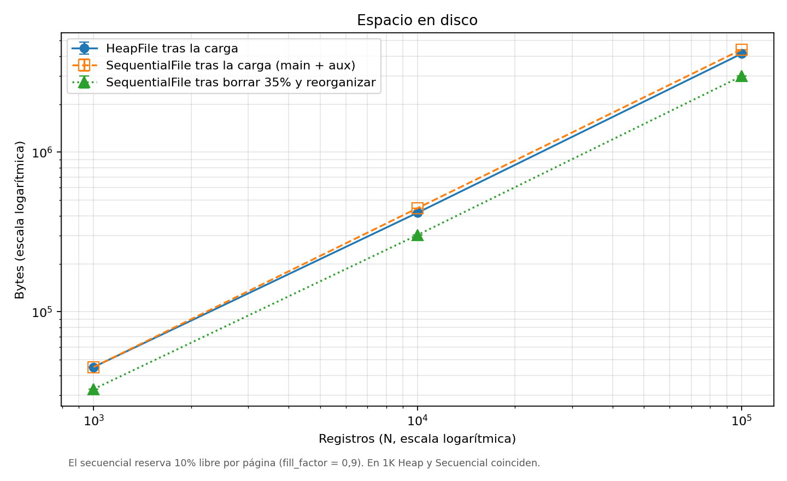
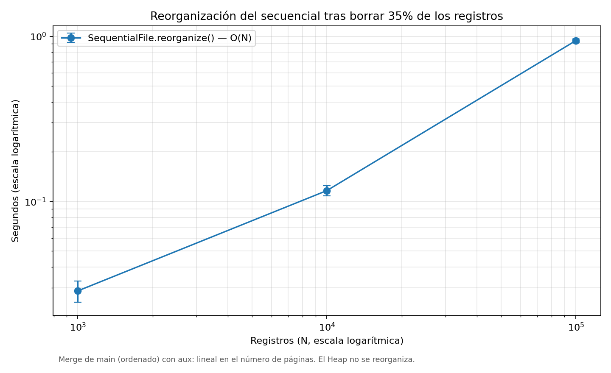
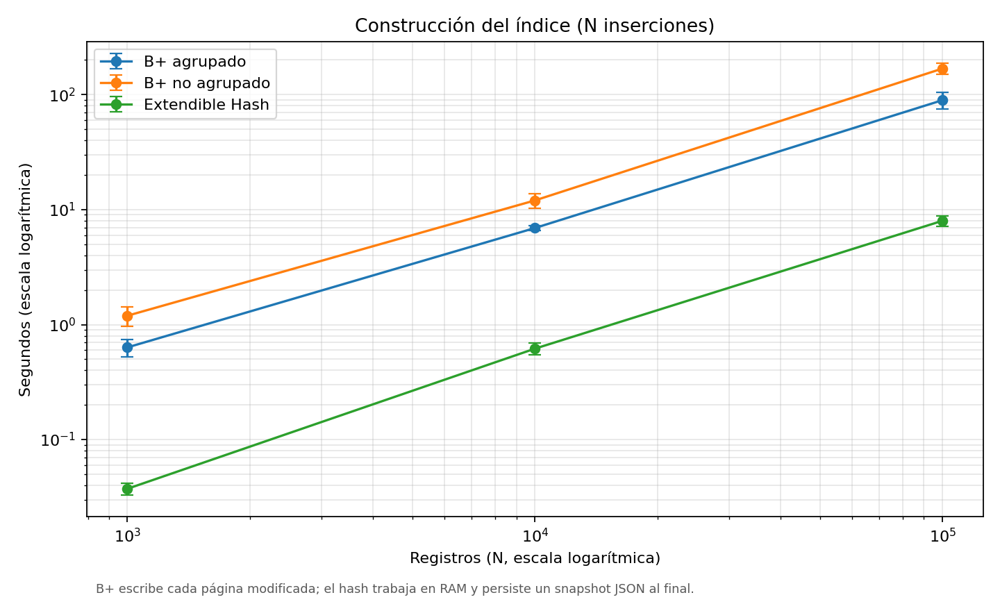
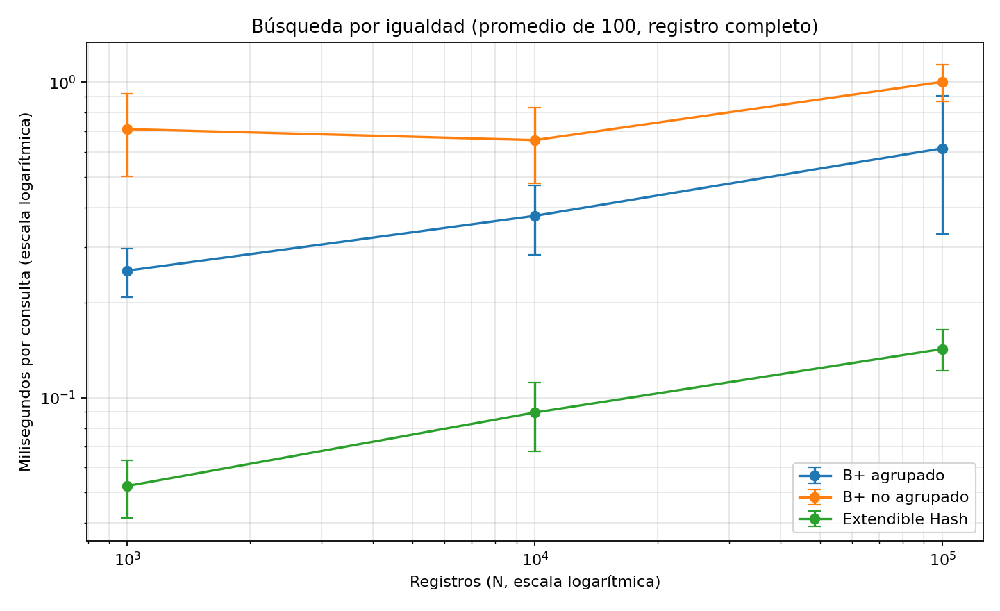
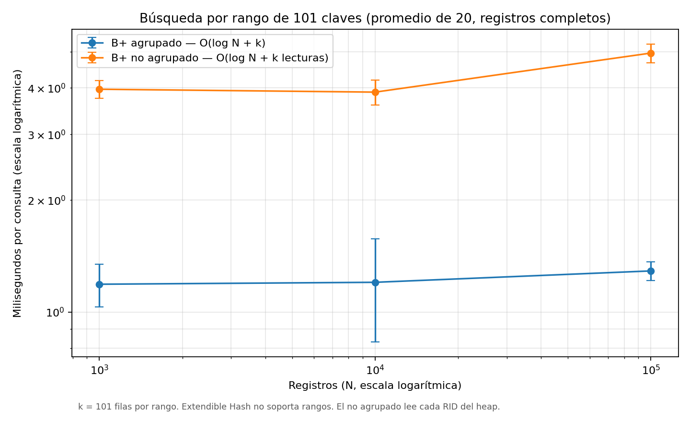
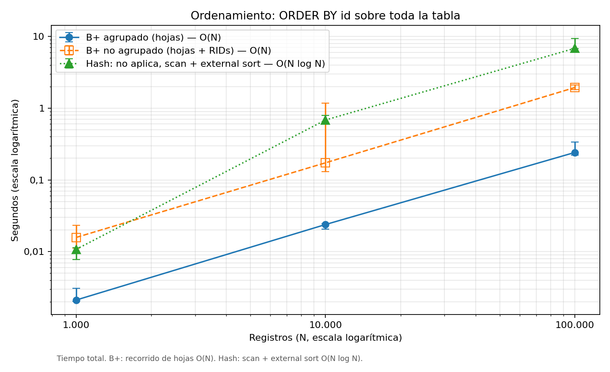
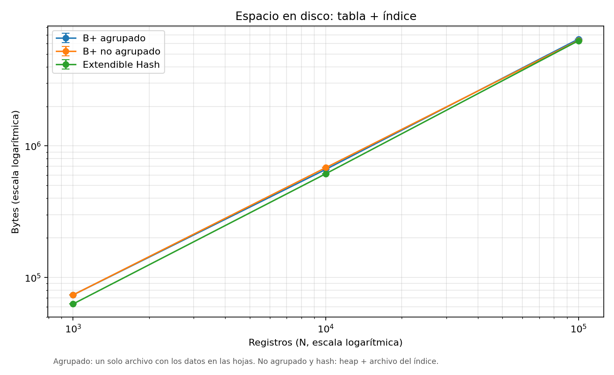
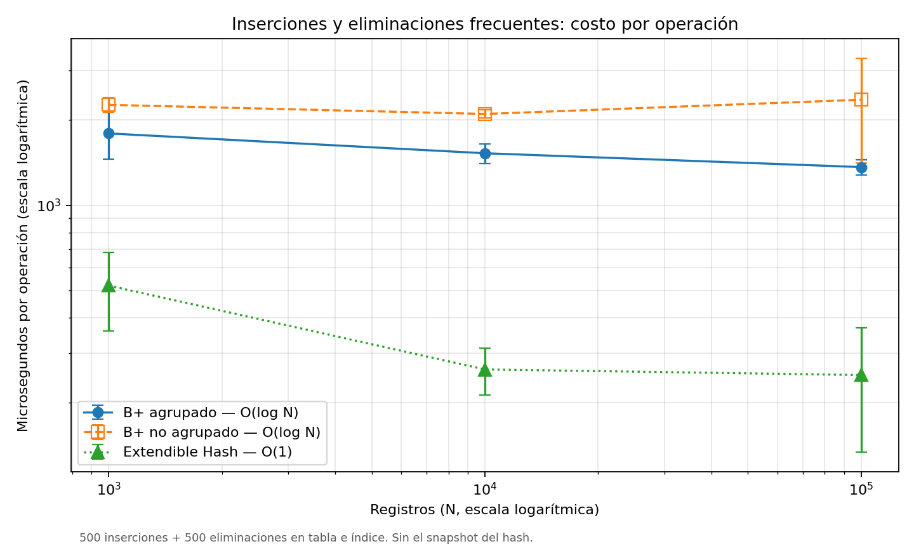

# Informe del Proyecto — Base de Datos II

## Avance 1: Motor Relacional

### 1. Arquitectura del Motor
- **Almacenamiento** (`engine/storage/`): Heap File (*slotted pages*), Archivo Secuencial Paginado y tabla organizada como B+ agrupado.
- **Índices** (`engine/indexes/`): B+ agrupado, B+ no agrupado y Hash extensible.
- **Consultas** (`engine/query/`): lexer, parser, plan lógico, optimizador por costos, ejecutor y algoritmos externos.
- **Concurrencia** (`engine/concurrency/`): locks de granularidad múltiple (IS/IX/S/SIX/X) con 2PL estricto, detección de deadlocks y transacciones con *undo log*.
- **Frontend** (`frontend/`): interfaz Tkinter de 4 paneles (archivos, consultas, resultados y plan de ejecución) en modo demo.

### 2. Decisiones de Diseño y Algoritmos

#### 2.1 Heap File con Arquitectura Slotted Page
Se implementó el almacenamiento en disco mediante páginas de tamaño fijo (**4096 bytes / 4 KB**), alineadas con el tamaño de bloque del sistema operativo y hardware de almacenamiento.

* **Estructura de Página**:
  - **Header (4 bytes)**: `num_slots` (uint16) y `data_end` (uint16).
  - **Área de Datos**: Crece desde el inicio (byte 4) hacia adelante.
  - **Directorio de Slots**: Crece desde el final (byte 4096) hacia atrás. Cada slot ocupa **5 bytes** (`offset: 2B`, `length: 2B`, `is_deleted: 1B`).
  - **Espacio Libre**: Bloque continuo en el centro (`slot_dir_start - data_end`), evitando fragmentación y eliminando la necesidad de desplazar datos en memoria.

* **Estabilidad de Punteros (RID)**:
  - Cada registro es identificado de forma única por un `RID(page_id, slot_id)`.
  - Se utiliza **eliminación lógica** (`is_deleted = 1` en el slot), preservando la posición física del slot para que los índices externos (B+ Tree y Hash) no queden corruptos.

* **Reutilización de Espacio**:
  - En inserciones, el motor primero busca slots marcados como eliminados para sobreescribir su espacio antes de consumir nuevo espacio contiguo.
  - El motor mantiene en memoria un conjunto `free_pages` con las páginas que tienen espacio para un slot nuevo o un slot borrado reutilizable. Se reconstruye al abrir el archivo y se actualiza en cada inserción y eliminación, sin escaneos completos de disco por operación.

#### 2.2 Archivo Secuencial Paginado (Sequential File)
Diseñado para tablas con orden físico por clave primaria o de ordenamiento, combinando páginas ordenadas con un área de desborde y reorganización periódica.

* **Estructura Física Dual (`main` y `aux`)**:
  - **`main`**: Páginas donde los registros y el directorio de slots se mantienen estrictamente ordenados por clave.
  - **`aux`**: Archivo de desborde (*overflow*) sin orden para inserciones rápidas cuando la página destino de `main` no cuenta con espacio suficiente.
  - **Identificador `RID(page_id, slot_id, file)`**: Registra el archivo de origen (`"main"` o `"aux"`), permitiendo accesos y eliminaciones transparentes.

* **Búsqueda e Inserción Binaria en Dos Niveles**:
  - **Nivel de Archivo**: Búsqueda binaria sobre separadores en memoria (`_page_max`, el máximo de cada página de `main`). Si una página queda vacía conserva su último máximo como separador, de modo que la búsqueda binaria no se desvía.
  - **Nivel de Página**: Búsqueda binaria (*lower bound*) sobre el directorio de slots con `_find_insert_position_in_page`.
  - **Inserción ordenada eficiente**: `insert_sorted_at` desplaza únicamente las entradas del directorio de slots (5 bytes por slot), sin reubicar los datos de los registros. Si la página destino está llena, el registro se agrega **al final** de `aux` (sin recorrer `aux` buscando huecos).
  - **Búsqueda por clave y por rango**: `search_by_key` devuelve todas las coincidencias (admite claves repetidas) recorriendo `main` desde el *lower bound* y revisando `aux`; `range_search(lower, upper)` mezcla (*merge*) el tramo ordenado de `main` con las coincidencias de `aux`.

* **Eliminación Lógica**:
  - Marca `is_deleted = 1` en el slot sin compactación inmediata y actualiza los límites de la página. La eliminación nunca dispara una reorganización, así los RIDs de un lote de borrado siguen siendo válidos.

* **Inestabilidad de RIDs en `main` (Trade-off de Diseño)**:
  - A diferencia del Heap File, los RIDs devueltos por inserciones en `main` no son estables: una inserción posterior en la misma página desplaza el `slot_id` de los registros existentes y una reorganización reescribe el archivo. El acceso recomendado es mediante `search_by_key`/`range_search`, y los índices secundarios deben reconstruirse tras modificar la tabla.

* **Disparadores de Reorganización**:
  - `needs_reorganization()` usa contadores en memoria (registros activos y borrados en `main`, registros en `aux`) y devuelve verdadero si:
    1. el **espacio desperdiciado supera el 30%**: `(borrados_main + registros_aux) / total > 0.30`, o
    2. `aux` supera **⌈log₂(páginas de main + 1)⌉ páginas**. Este segundo límite (decisión propia) mantiene la búsqueda en O(log P) lecturas: sin él, con inserciones aleatorias casi todos los registros terminaban en `aux` y la búsqueda degeneraba en un recorrido lineal.
  - Con `auto_reorganize=True` (valor por defecto) la verificación se hace **antes** de cada inserción, de modo que el RID devuelto sigue siendo válido al retornar.

* **Reorganización con `fill_factor` (Decisión Propia de Diseño)**:
  - `main` ya está ordenado, así que se recorre en *streaming*; solo `aux` (acotado por el disparador) se ordena en memoria. Ambos flujos se combinan con un *merge* y se escriben en un archivo nuevo que reemplaza a `main` al terminar (`os.replace`); los registros eliminados se purgan y `aux` queda vacío.
  - Las páginas nuevas se llenan al **90% (`fill_factor = 0.9`)**. La holgura del 10% admite inserciones ordenadas directamente en `main` sin desbordar de inmediato hacia `aux`.

#### 2.3 Índice Hash Dinámico (Extendible Hashing)

Implementado en `engine/indexes/extendible_hash.py` para acelerar búsquedas por igualdad sobre registros almacenados en Heap File o Sequential File. El índice mantiene un directorio global y buckets con capacidad configurable, adaptando su estructura mediante divisiones y fusiones.

* **Directorio Global y Buckets**:
  - El directorio contiene `2 ** global_depth` referencias a buckets. Inicialmente, la profundidad global es **1** y existen **dos buckets** con profundidad local **1**.
  - Cada bucket almacena pares **`(clave, RID)`**, conservando el registro completo en el archivo de datos. El RID incluye `page_id`, `slot_id` y `file`, permitiendo distinguir `main` y `aux`.
  - `bucket_capacity` limita la cantidad de pares por bucket (**4 por defecto**). Varias entradas del directorio pueden apuntar al mismo bucket cuando su profundidad local es menor que la global.

* **Función Hash y Profundidades**:
  - Se utiliza **BLAKE2b de 64 bits** sobre una representación estable de la clave, evitando la variación de `hash(str)` entre procesos de Python.
  - Los bits menos significativos seleccionan la posición del directorio mediante `hash_clave & ((1 << global_depth) - 1)`. La profundidad global determina cuántos bits se consultan y la local cuántos identifican a cada bucket.
  - Se admiten claves `int`, `float` finitos y `str`. Valores numéricamente iguales, como `1` y `1.0`, se consideran la misma clave.

* **Inserción, Split y Duplicación del Directorio**:
  - `insert(key, rid)` localiza el bucket y agrega el par si existe espacio. Las claves repetidas con distintos RIDs están permitidas; un par idéntico no se inserta dos veces.
  - Si el bucket está lleno y sus entradas pueden separarse, se incrementa su profundidad local, se crea un bucket hermano y se redistribuyen los pares según el nuevo bit disponible.
  - Cuando la profundidad local iguala la global antes del split, se duplica el directorio y se incrementa la profundidad global, conservando las referencias a los buckets que no se dividen.

* **Colisiones y Buckets de Desborde (Decisión de Diseño)**:
  - Las claves repetidas y los hashes que no se pueden separar con los bits disponibles utilizan una cadena de buckets de desborde, cada uno sujeto a `bucket_capacity`.
  - `max_depth` limita el crecimiento del directorio (**16 por defecto**, configurable entre **1 y 20**). Al alcanzar ese límite también se utiliza desborde, evitando divisiones indefinidas.

* **Búsqueda por Igualdad**:
  - `search(key)` accede al bucket indicado por el hash y recorre sus entradas y su cadena de desborde, comparando las claves para distinguir colisiones.
  - Devuelve todos los RIDs coincidentes, o una lista vacía si la clave no existe. Los registros completos se recuperan mediante `storage.get(rid)`; el índice no implementa búsquedas por rango.

* **Eliminación, Merge y Contracción**:
  - `delete(key, rid)` elimina un par específico; sin RID, elimina todas las entradas de la clave. La operación devuelve la cantidad de pares eliminados y compacta la cadena de desborde.
  - Se fusionan buckets hermanos cuando tienen la misma profundidad local y sus entradas combinadas caben en un solo bucket. Las referencias del directorio se actualizan al bucket resultante.
  - Si ambas mitades del directorio contienen las mismas referencias, este se reduce a la mitad. La contracción se repite hasta donde sea posible, manteniendo una profundidad global mínima de **1**.

* **Carga Masiva e Integración con Storage**:
  - `bulk_load` recibe un iterable de pares `(clave, RID)`. `bulk_load_from_storage` obtiene esos pares recorriendo los registros activos del archivo mediante `scan()` y extrayendo el campo indexado.
  - Se agregó `SequentialFile.scan()` para recorrer `main` y `aux` con sus RIDs físicos actuales, omitiendo registros eliminados. La fuente se procesa de forma incremental, mientras el índice resultante reside en memoria.
  - La carga desde storage reconstruye el índice por defecto: solo reemplaza la estructura anterior cuando termina correctamente. Si falla, conserva el índice anterior; durante la construcción ambas estructuras ocupan memoria.
  - Las inserciones ordenadas y reorganizaciones del Sequential File pueden invalidar RIDs existentes, por lo que requieren reconstruir el índice antes de consultarlo. Desde SQL, el catálogo sincroniza storage e índices automáticamente (sección 2.6); quien use el índice directamente debe sincronizarlo.

* **Persistencia Opcional y Alcance**:
  - El directorio y los buckets operan en memoria. Al especificar `filepath`, se guarda un **snapshot JSON versionado** con la configuración y los pares mediante `flush()`, `close()` o al salir de un bloque `with`.
  - El guardado escribe un archivo temporal y reemplaza el destino al terminar. Al reabrir, se reconstruye el directorio a partir de las entradas persistidas.
  - Esta implementación no utiliza páginas de buckets en disco ni proporciona transacciones entre el índice y el storage. `stats()` reporta profundidad, entradas, buckets únicos, desborde y ocupación sin contar dos veces las referencias compartidas.

* **Validación mediante Pruebas**:
  - Las pruebas cubren splits con y sin duplicación del directorio, claves repetidas, colisiones forzadas, eliminación y fusión de buckets, y operaciones aleatorias contrastadas con un modelo de referencia.
  - También verifican carga masiva desde ambos storages, reconstrucción tras cambios de RIDs y persistencia entre procesos, incluyendo la conservación del snapshot anterior ante un fallo de guardado.

#### 2.4 Transacciones y Control de Concurrencia

Implementado en `engine/concurrency/` (`LockManager`, `TransactionManager`) y `engine/query/statement_executor.py`. Cada usuario (o hilo) tiene su propia sesión SQL (`StatementExecutor`); el catálogo, el `LockManager` y el `TransactionManager` se comparten entre sesiones.

* **Transacciones**: `BEGIN [TRANSACTION]`, `END [TRANSACTION]` / `COMMIT` y `ROLLBACK`. Una sentencia fuera de una transacción se ejecuta en modo *autocommit*. Cada INSERT y DELETE registra su inversa en un *undo log*; el ROLLBACK la aplica en orden inverso antes de liberar los locks.

* **Locks de granularidad múltiple con 2PL estricto**: los locks se piden durante la transacción y se liberan todos juntos en COMMIT/ROLLBACK.

  | Sentencia | Lock sobre la tabla | Lock sobre la fila (clave) |
  | :--- | :---: | :---: |
  | `SELECT` | S | — |
  | `INSERT` | IX | X |
  | `DELETE` | SIX (lee la tabla para evaluar el WHERE) | X |

  Matriz de compatibilidad (✔ = pueden coexistir):

  | Pedido ↓ / Tenido → | IS | IX | S | SIX | X |
  | :---: | :---: | :---: | :---: | :---: | :---: |
  | **IS** | ✔ | ✔ | ✔ | ✔ | ✘ |
  | **IX** | ✔ | ✔ | ✘ | ✘ | ✘ |
  | **S** | ✔ | ✘ | ✔ | ✘ | ✘ |
  | **SIX** | ✔ | ✘ | ✘ | ✘ | ✘ |
  | **X** | ✘ | ✘ | ✘ | ✘ | ✘ |

  Consecuencias: varias transacciones pueden insertar claves distintas en paralelo (IX es compatible con IX); un SELECT espera a que terminen las escrituras sin confirmar, por lo que **no hay lecturas sucias**; y una transacción que lee y luego escribe convierte su S en SIX (*upgrade*).

* **Detección de deadlocks**: antes de esperar un lock, el `LockManager` construye el grafo de espera (*wait-for graph*) y busca un ciclo con DFS. Si la espera cerraría un ciclo, lanza `DeadlockError`; la sesión aborta **toda** la transacción (ROLLBACK), libera sus locks y la otra transacción continúa. El cliente reintenta la abortada tras una espera aleatoria (*backoff*). El caso típico es el de dos transacciones que leen la misma tabla (S) y luego ambas intentan escribir (SIX).

* **Latches físicos**: además de los locks lógicos, cada archivo (`HeapFile`, `SequentialFile`) y cada tabla del catálogo tienen un *latch* corto (`threading.RLock`). Protege el descriptor de archivo compartido (`seek` + `read`/`write` no es atómico entre hilos), la lectura-modificación-escritura de páginas y la reconstrucción de índices. Regla de orden: primero el lock lógico y después el latch; **nunca se espera un lock reteniendo un latch**, así no aparecen deadlocks invisibles para el detector.

* **Rollback robusto**: los RIDs del Sequential File cambian al insertar en una página o al reorganizar, por lo que el undo no confía solo en el RID guardado: si ya no contiene el registro, lo localiza por clave (`search_by_key`) o por contenido. Cada operación deshecha actualiza también los índices (fila por fila en el heap; reconstrucción al final en el secuencial y en el B+ agrupado).

* **Demostración** (`python -m benchmarks.concurrency_demo`, verificada también en `tests/concurrency/`). Usa el motor real con sentencias SQL:
  1. **Race condition sin control**: dos hilos leen el saldo (1.000), restan 100 y 200 y escriben directamente en el archivo; el resultado es 800 en vez de 700 (*lost update*).
  2. **La misma operación con transacciones**: tres usuarios hacen `BEGIN TRANSACTION; SELECT ...; DELETE ...; INSERT ...; END TRANSACTION` tres veces cada uno. Los conflictos aparecen como deadlocks; las transacciones abortadas se deshacen y se reintentan, y el saldo final es exacto (1.000 − 3·(10+20+30) = 820).
  3. **Transacciones simultáneas**: cuatro transacciones insertan 50 cuentas cada una con intervalos de ejecución solapados; se guardan las 200 filas.
  4. **Lectura sucia evitada**: un SELECT lanzado mientras otra transacción tiene una inserción sin confirmar espera, y tras el ROLLBACK no ve la fila.
  5. **Deadlock explícito**: de dos transacciones que se esperan mutuamente, una se aborta y la otra confirma.

#### 2.5 Índices B+ (agrupado y no agrupado)

Implementados en `engine/indexes/bplus_tree.py` y especializados en `bplus_tree_clustered.py` y `bplus_tree_unclustered.py`.

* **Organización en disco**: la página 0 guarda el *header* (orden M, raíz, hoja más a la izquierda, cantidad de páginas y una firma del esquema). Cada nodo ocupa una página de 4096 B. M se elige para que un nodo lleno quepa en la página: **M = 254** en el no agrupado (clave entera + RID empaquetado de 8 B) y **M = 92** en el agrupado (clave + registro de 36 B).
* **Invariante**: cada separador de un nodo interno es igual a la primera clave de su subárbol derecho, y las hojas forman una lista enlazada (`nextLeaf`) que permite recorrer rangos en orden.
* **Inserción en O(altura)**: se baja a la hoja y se inserta ordenado. Si la hoja desborda, se divide y la primera clave de la mitad derecha sube al padre (el split puede propagarse hasta crear una nueva raíz). Si la clave nueva queda primera en su hoja, se actualiza un único separador en el ancestro correspondiente.
* **Eliminación en O(altura)**: si el nodo queda por debajo del mínimo, primero intenta **redistribuir** con un hermano y, si no se puede, **fusiona**. En nodos internos el separador del padre rota (baja al nodo y sube la clave del hermano) o baja al fusionar. Ninguna operación vuelve a leer subárboles completos: una prueba acota las páginas leídas por operación a 4·altura + 2.
* **B+ agrupado**: las hojas guardan los registros completos ordenados por una clave única. Desde SQL se crea con `CREATE TABLE ... USING BTREE` (`ClusteredBPlusFile`): la tabla **es** el árbol y su clave se registra como índice agrupado para igualdad, rangos y ORDER BY.
* **B+ no agrupado**: las hojas guardan pares (clave, RID) y admiten claves repetidas; los registros siguen en el heap o el secuencial. Desde SQL se crea con `CREATE INDEX ... USING BTREE`.

#### 2.6 Procesamiento de Consultas SQL

El pipeline está en `engine/query/`: `lexer` → `parser` (descenso recursivo, con mensajes de error que indican línea y columna) → AST → `LogicalPlanner` → `SQLOptimizer`/`QueryPlanner` → `SQLExecutor`.

* **Plan lógico**: `Scan`, `Filter`, `Join`, `Aggregate`, `Distinct`, `Sort`, `Project`, `Limit`, `Insert` y `Delete`. La validación semántica (columnas inexistentes o ambiguas, columnas fuera de GROUP BY, agregados en el WHERE, etc.) ocurre al planificar, antes de leer datos.
* **Optimizador por costos**: estima páginas leídas con estadísticas del catálogo (filas, páginas, valores distintos y mínimo/máximo por columna). Un acceso por índice no agrupado cuesta una lectura aleatoria por fila (`random_page_cost` = 4); uno agrupado cuesta las páginas contiguas del rango. Así decide entre:
  - scan secuencial, `index_scan` (igualdad con hash o B+) o `index_range_scan` (`<`, `<=`, `>`, `>=`, `BETWEEN` con B+; la selectividad se interpola con el mínimo y máximo de la columna);
  - `external_sort` o recorrido ordenado del índice para ORDER BY;
  - `external_hash_group_by` o agrupación sobre un recorrido ordenado para GROUP BY;
  - `external_hash_join` o *index nested loop join* para JOIN.
* **EXPLAIN y EXPLAIN ANALYZE** (`engine/query/explain.py`): muestran el plan con el formato de texto de PostgreSQL (`Seq Scan`, `Index Scan [Backward] using … on …`, `Sort`, `HashAggregate`/`GroupAggregate`, `Hash Join`, `Nested Loop`, `Limit`, `Unique`) con `Index Cond`, `Filter`, `Sort Key`, `Group Key` y `Hash Cond`. Los costos son los del modelo del motor (páginas). `ANALYZE` ejecuta la sentencia midiendo cada operador (tiempo hasta la primera y la última fila, filas reales y ejecuciones) y agrega `Rows Removed by Filter`, `Sort Method`, `Planning Time` y `Execution Time`. Así se compara lo estimado contra lo medido; por ejemplo, para `WHERE nota >= 14` sobre 1.000 alumnos se estiman 333 filas (interpolando entre la nota mínima y la máxima) y se obtienen 355.
* **Clave primaria y carga de CSV**: `PRIMARY KEY` rechaza duplicados (comprobación hecha con el lock X de la fila, por lo que dos transacciones no pueden insertar la misma clave) y crea el índice implícito `<tabla>_pkey`. `COPY ... FROM 'archivo.csv'` (sintaxis de PostgreSQL) valida el archivo completo antes de insertar e informa la línea del primer error; la carga es una única transacción.
* **Mantenimiento de índices**: en el Heap File cada INSERT/DELETE actualiza los índices fila por fila; en el secuencial y en el B+ agrupado, cuyos RIDs se mueven, los índices secundarios se reconstruyen una vez al final de la sentencia. Las estadísticas se ajustan por fila y se recalculan completas cada 50 + 10% de cambios (*auto-analyze*).
* **Validación contra SQLite**: `tests/query/test_sqlite_oracle.py` carga los mismos datos en el motor y en SQLite y compara 59 consultas (filtros, expresiones, ORDER BY, LIMIT/OFFSET, GROUP BY/HAVING, DISTINCT, agregados DISTINCT y JOIN) sobre heap con índices, secuencial y B+ agrupado.

#### 2.7 Algoritmos Externos

Implementados en `engine/query/external_algorithms.py` siguiendo el modelo de buffer de **B páginas de R registros** (por defecto B = 8 y R = 128). Los temporales usan un formato binario propio y se eliminan al terminar.

* **External sort (ORDER BY)**: genera *runs* ordenados de B·R registros y los mezcla con un *merge* k-way de hasta B−1 runs por pasada, con tantas pasadas como haga falta. Admite varias claves, ASC/DESC por clave y posición de NULL; es estable.
* **External hash GROUP BY**: reparte las filas en B−1 particiones con una función hash distinta por nivel y agrega cada partición con una tabla en memoria de hasta (B−2)·R grupos. Si una partición no cabe, se vuelve a particionar; ante *skew* sin progreso recurre a ordenar y agregar en orden. Los agregados DISTINCT eliminan duplicados (grupo, valor) con el mismo mecanismo antes de agregar.
* **External hash JOIN (Grace)**: particiona ambas entradas con la misma función, construye una tabla sobre la partición más chica y la sondea con la otra; con *skew* procesa bloques de (B−2)·R registros. Cuando el lado derecho tiene un índice de igualdad y el izquierdo es pequeño, el optimizador prefiere el *index nested loop join*.

#### 2.8 Interfaz de Usuario (modo demo)

`frontend/` implementa los 4 paneles con Tkinter sobre la fachada `Motor`: **Archivos** (tablas, almacenamiento, campos, índices y estadísticas), **Consultas** (editor SQL de varias sentencias), **Resultados** y **Plan de ejecución**. Como en `psql`, el plan no aparece en cada consulta: se muestra cuando el usuario ejecuta `EXPLAIN` o `EXPLAIN ANALYZE`, en el panel de plan y como columna `QUERY PLAN` en resultados. Cada sesión es un `StatementExecutor`, así que las transacciones del editor usan los mismos locks que la demo de concurrencia.

El frontend funciona en **modo demo**: al iniciar vacía `demo_data/` (solo los archivos que genera el motor) y crea las tablas de ejemplo `cuentas` y `productos`, por lo que lo creado en una sesión no se conserva al cerrar. Es una decisión de uso de la interfaz: la capa de almacenamiento sí reabre sus archivos (HeapFile, SequentialFile, B+ y snapshot del hash), y los tests de reapertura lo verifican. Al cerrar se liberan todos los descriptores de archivo, requisito para poder borrarlos en Windows.

### 3. Resultados Experimentales y Benchmarks

### 3.1 Metodología
Las pruebas se ejecutan con scripts de consola independientes del frontend (`benchmarks/bench_storage.py` y `benchmarks/bench_indexes.py`); el detalle completo está en `benchmarks/README.md`.

* **Tamaños de dataset**: **1.000**, **10.000** y **100.000** registros.
* **Datos**: semilla fija **42**; claves únicas 0..N-1 insertadas en orden **aleatorio** (no favorece al Archivo Secuencial). Esquema `id` (int), `nombre` (20 caracteres ASCII) y `precio` (float): **36 bytes por registro**.
* **Páginas** de **4096 bytes** en todas las estructuras.
* **Repeticiones**: **3 corridas por tamaño**. Las tablas reportan la **media**, y las gráficas muestran barras de error de ± 1 desviación estándar (`*_comparison.csv`; cada corrida está en `*_runs.csv`).
* **Gráficas en escala log-log** (también las de espacio), para comparar crecimientos sin distorsiones.
* **Entorno**: Windows 11 (AMD64), Python 3.13.5, sin vaciar la caché del sistema operativo. La corrida de almacenamiento tomó **250 s** y la de índices **1.043 s**.

> **Corrección respecto de la versión anterior de este informe.** La medición original (18/09) tenía tres problemas que invalidaban varias conclusiones:
> 1. El Archivo Secuencial dejaba **una sola página en `main`** y enviaba el resto de los registros a `aux` (con N=10.000: 1 página en `main` y 101 en `aux`). En la práctica se comparaba un heap contra otro heap, la búsqueda del secuencial era lineal y el espacio en disco salía idéntico.
> 2. La búsqueda del Heap recorría el archivo completo aunque la clave fuera primaria, y el B+ no agrupado devolvía RIDs sin leer los registros del heap.
> 3. El B+ recalculaba todos los separadores del camino tras **cada** inserción y eliminación. Además, todos los índices usaban M = 64, sin importar el tamaño real de sus entradas.
>
> Se corrigieron el motor (secuencial con reorganización automática; inserción y eliminación del B+ en O(altura)) y los benchmarks. Todos los números de esta sección provienen de la nueva corrida.

### 3.2 Comparación de Almacenamiento: Heap File vs Archivo Secuencial

#### Tiempo de inserción

| N | Heap File | Sequential File | Secuencial / Heap | Reorganizaciones automáticas |
| ---: | ---: | ---: | ---: | ---: |
| 1.000 | 0,094 s | 0,243 s | 2,6× | 4 |
| 10.000 | 0,752 s | 2,176 s | 2,9× | 13 |
| 100.000 | 7,585 s | 24,726 s | 3,3× | 31 |

El Heap File inserta en la primera página con espacio (conjunto `free_pages` en memoria), con costo O(1). El Sequential File hace, en cada inserción, una búsqueda binaria de la página y del slot, y desplaza el directorio de slots. Cuando `aux` supera su límite o el desperdicio pasa del 30%, se reorganiza. El tiempo del secuencial **incluye sus 31 reorganizaciones** en 100.000 registros. Aun así, crece de forma casi lineal: con la versión anterior la misma carga tardaba **1.459 s** (59 veces más), porque cada inserción recorría todo `aux` buscando espacio.

#### Tiempo de búsqueda por clave primaria

Promedio por consulta (100 claves existentes):

| N | Heap File | Secuencial tras la carga | Secuencial tras reorganizar |
| ---: | ---: | ---: | ---: |
| 1.000 | 3,53 ms | 0,84 ms | 0,046 ms |
| 10.000 | 25,43 ms | 0,078 ms | 0,061 ms |
| 100.000 | 255,16 ms | 0,214 ms | 0,068 ms |

* El Heap no tiene orden, así que realiza un recorrido lineal O(N), aun deteniéndose en la primera coincidencia: su tiempo crece 10× cuando N crece 10×.
* El secuencial combina búsqueda binaria en `main` con la revisión de `aux`, que está acotado a ⌈log₂(P+1)⌉ páginas. En 100.000 registros es **1.194 veces más rápido** que el Heap tras la carga y **3.755 veces más rápido** tras reorganizar (con `aux` vacío). Tras reorganizar, el tiempo es prácticamente constante (0,05–0,07 ms), como se espera de O(log N).
* El valor tras la carga depende de cuán lleno quedó `aux` al terminar: en 1.000 registros `aux` puede tener hasta 4 páginas frente a unas 11 de `main`, y su recorrido domina el costo.

#### Espacio en disco

| N | Heap File | Secuencial tras la carga | Secuencial tras borrar 35% y reorganizar |
| ---: | ---: | ---: | ---: |
| 1.000 | 45.056 B | 45.056 B | 32.768 B |
| 10.000 | 417.792 B | 446.464 B (+6,9%) | 303.104 B |
| 100.000 | 4.141.056 B | 4.395.008 B (+6,1%) | 2.994.176 B |

El Heap llena cada página al 100%. El secuencial reconstruye `main` con `fill_factor = 0,9`: deja un 10% libre por página para absorber inserciones y además mantiene algunas páginas en `aux`. Eso explica un sobrecosto de alrededor del 6%. En 1.000 registros, las inserciones posteriores a la última reorganización volvieron a llenar las páginas, y el tamaño coincide con el del Heap.

#### Proceso de reorganización

Tras borrar el **35%** de los registros (no cronometrado), `needs_reorganization()` se activa porque el desperdicio supera el **30%**. `reorganize()` tardó **0,026 s**, **0,085 s** y **0,681 s** para 1.000, 10.000 y 100.000 registros: crece de forma lineal con el número de páginas. Como `main` ya está ordenado, se recorre una sola vez y se combina (*merge*) con `aux` ordenado; no hace falta ordenar toda la tabla en memoria. El archivo resultante ocupa un 32% menos que tras la carga. El Heap no necesita reorganizarse, porque reutiliza los slots borrados.

#### Resumen y conclusiones de almacenamiento

| Técnica | Ventajas | Desventajas | Escenario recomendado |
| :--- | :--- | :--- | :--- |
| **Heap File** | Inserción O(1), la más rápida (3,3× frente al secuencial en 100K); RIDs estables; reutiliza slots borrados sin mantenimiento. | Búsqueda por clave O(N): 255 ms por consulta en 100K sin índice; no conserva orden. | Cargas con alta tasa de escritura, o tablas que siempre se consultan mediante un índice secundario. |
| **Sequential File** | Búsqueda por clave y por rango en O(log N): 0,07–0,21 ms en 100K, más de 1.000× más rápida que el heap; datos físicamente ordenados. | Inserción ~3× más lenta (búsqueda binaria + reorganizaciones); RIDs inestables; ~6% más de espacio por el `fill_factor`. | Tablas de lectura predominante con consultas por clave primaria o por rango. |

### 3.3 Comparación de Índices: B+ Agrupado vs B+ No Agrupado vs Hash Dinámico

**Configuración.** Cada estructura usa nodos que llenan una página de 4096 B:
* B+ agrupado: **M = 92**, porque cada entrada de hoja guarda clave + registro de 36 B.
* B+ no agrupado: **M = 254**, porque cada entrada guarda clave + RID de 8 B.
* Hash: buckets de **254 entradas**.

**Todas las consultas devuelven registros completos.** El agrupado los tiene en sus hojas; el no agrupado y el hash leen cada RID de un `HeapFile` real. Así se compara el costo real de responder una consulta.

#### Tiempo de construcción

| N | B+ agrupado | B+ no agrupado | Extendible Hash |
| ---: | ---: | ---: | ---: |
| 1.000 | 0,63 s | 1,19 s | 0,04 s |
| 10.000 | 6,92 s | 12,03 s | 0,62 s |
| 100.000 | 89,61 s | 168,80 s | 8,00 s |

* El hash es **21 veces más rápido** que el B+ no agrupado en 100K. Trabaja en RAM y escribe un único snapshot JSON al final (incluido en el tiempo), mientras que el B+ escribe y hace `flush` de cada página que modifica.
* El no agrupado tarda **1,88 veces** más que el agrupado aunque sus entradas son más pequeñas. Con M = 254, cada escritura de nodo serializa casi el triple de entradas que con M = 92.
* Con la versión anterior del B+ (M = 64 y recálculo completo de separadores en cada inserción), construir 100K registros tomaba **698 s** (agrupado) y **443 s** (no agrupado).

#### Búsqueda por igualdad

Promedio por consulta, registro completo:

| N | B+ agrupado | B+ no agrupado | Extendible Hash |
| ---: | ---: | ---: | ---: |
| 1.000 | 0,28 ms | 0,65 ms | 0,05 ms |
| 10.000 | 0,37 ms | 0,75 ms | 0,09 ms |
| 100.000 | 0,46 ms | 0,99 ms | 0,10 ms |

El hash es el más rápido: calcula el bucket directamente (BLAKE2b) en RAM y hace **una sola lectura** del heap. El B+ agrupado lee la altura del árbol y encuentra el registro en la hoja. El no agrupado lee la altura del árbol **más** una página del heap, por eso es entre 2,0 y 2,4 veces más lento que el agrupado. Los tres crecen poco con N (O(1) y O(log N)).

#### Búsqueda por rango

Promedio de 20 rangos `[k, k+100]` (101 registros):

| N | B+ agrupado | B+ no agrupado |
| ---: | ---: | ---: |
| 1.000 | 1,04 ms | 2,02 ms |
| 10.000 | 1,13 ms | 3,20 ms |
| 100.000 | 1,14 ms | 3,44 ms |

En el **agrupado** los 101 registros están contiguos en 1 o 2 hojas. El **no agrupado** recorre sus hojas, pero debe leer cada uno de los 101 RIDs en una página distinta del heap. Como los datos se insertaron en orden aleatorio, claves vecinas quedan en páginas distintas, y el agrupado resulta **3 veces más rápido** en 100K. (La versión anterior del informe concluía lo contrario porque el no agrupado no leía los registros.) El **Extendible Hash no soporta rangos**: la función hash dispersa claves consecutivas en buckets distintos.

#### Ordenamiento (ORDER BY)

`ORDER BY id` sobre toda la tabla: **0,50 s** (agrupado), **3,74 s** (no agrupado) y **12,54 s** (hash) con 100K registros.
* El agrupado recorre sus hojas encadenadas, que ya están ordenadas.
* El no agrupado obtiene el orden de sus hojas, pero hace una lectura aleatoria del heap por cada registro: 7,5 veces más lento que el agrupado.
* El hash no aporta orden, así que el motor recurre a `scan` del heap + *external sort* k-way: 25 veces más lento que el agrupado.

#### Espacio en disco y memoria

Espacio total de **tabla + índice** con 100K registros (el heap solo, sin índice, ocupa 4.141.056 B):
* **B+ agrupado**: 6.496.256 B, en un solo archivo (1.585 nodos). Ocupa 2,36 MB más que el heap porque sus hojas quedan llenas en promedio al ~69% tras los splits.
* **B+ no agrupado**: heap + 2,21 MB de índice (539 nodos), en total 6.352.896 B.
* **Extendible Hash**: heap + snapshot JSON de 2,17 MB, en total 6.310.040 B. En ejecución ocupa además **23,8 MB de RAM** (directorio de 512 entradas, 512 buckets, factor de carga 0,77), porque el índice vive completo en memoria.

Los tres terminan ocupando de 1,52 a 1,57 veces lo que ocupa el heap solo. La diferencia más importante es que el hash consume RAM proporcional a N.

#### Inserciones y eliminaciones frecuentes

500 ciclos de inserción + eliminación (1.000 operaciones, en tabla e índice):

| N | B+ agrupado | B+ no agrupado | Extendible Hash |
| ---: | ---: | ---: | ---: |
| 1.000 | 1,04 s | 1,36 s | 0,29 s |
| 10.000 | 1,05 s | 1,33 s | 0,22 s |
| 100.000 | 1,26 s | 1,82 s | 1,28 s |

* En el B+, inserción y eliminación cuestan O(altura): los splits, redistribuciones y fusiones actualizan solo los separadores afectados. Por eso el tiempo casi no cambia entre 1.000 y 100.000 registros (de 1,0 a 1,3 s en el agrupado).
* Con la versión anterior, que recalculaba los separadores de todo el camino al eliminar, las mismas 1.000 operaciones tomaban **17,4 s** (agrupado) y **23,9 s** (no agrupado) en 100K: ahora son **14 y 13 veces más rápidas**.
* El hash resuelve cada operación en RAM; su tiempo en 100K incluye además reescribir el snapshot JSON completo (2,17 MB) al final, por lo que ahí queda a la par del B+ agrupado.

#### Resumen y conclusiones de índices

| Técnica | Ventajas | Desventajas | Escenario recomendado |
| :--- | :--- | :--- | :--- |
| **B+ Agrupado** | El mejor en rangos (3× frente al no agrupado) y en ORDER BY (7,5×); igualdad en O(log N) sin I/O adicional; actualizaciones en O(altura). | Solo uno por tabla (define el orden físico); splits mueven registros completos; ~57% más espacio que un heap. | Clave primaria de tablas con consultas de rango, ordenamientos o recorridos por clave (`CREATE TABLE ... USING BTREE`). |
| **B+ No Agrupado** | Rangos y orden sobre cualquier columna; permite varios por tabla; claves duplicadas. | Una lectura aleatoria del heap por registro: 3× más lento que el agrupado en rangos y 7,5× en ORDER BY. | Índices secundarios sobre columnas con filtros de rango selectivos (pocos registros por consulta). |
| **Extendible Hash** | La igualdad más rápida (0,10 ms en 100K); construcción 21× más rápida. | No soporta rangos ni orden; reside en RAM (23,8 MB para 100K) y persiste por snapshot completo, cuyo costo crece con N. | Búsquedas exactas y joins por igualdad sobre claves que no se consultan por rango. |

### 3.4 Conclusión general de la Parte 1
No existe una estructura óptima para todo: cada una equilibra de forma distinta el costo de escritura, la latencia de lectura y el consumo de recursos.
* Para **alta tasa de escritura con consultas de punto exacto**, la mejor combinación es **Heap File + Extendible Hash**: inserción O(1) y búsqueda en ~0,1 ms, a cambio de mantener el índice en RAM. Desde SQL, los índices se mantienen fila por fila en cada INSERT/DELETE (no se reconstruyen).
* Para **consultas por rango u ordenamiento sobre la clave primaria**, conviene un **B+ agrupado**, o un **Sequential File** si la tabla se lee mucho más de lo que se escribe. Las mediciones corregidas muestran que la búsqueda binaria del secuencial supera al heap por más de tres órdenes de magnitud, a cambio de insertar ~3 veces más lento.
* El **B+ no agrupado** se justifica para columnas secundarias con filtros selectivos. En rangos grandes o en ORDER BY de toda la tabla, sus lecturas aleatorias al heap lo vuelven varias veces más lento que el agrupado.
